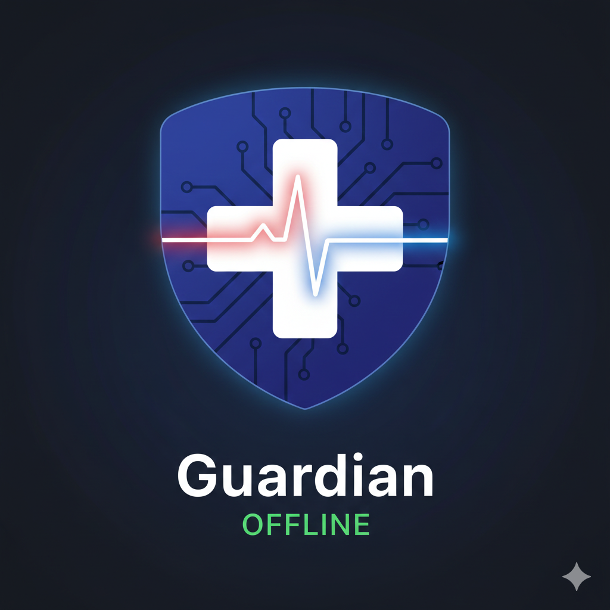

<i><h1>GuardianOffline</h1></i>
An offline-first emergency medical guidance PWA

<h3>Project Title :</h3>GuardianOffline 

<h3>The Problem: </h3> Briefly explain the "Connectivity Gap" in emergencies. 

<h3>The Solution:</h3> Explain how your app provides "Zero-Latency" guidance without internet.

<h3>Tech Stack:</h3> HTML5, CSS3, JavaScript. 

<h3>How to use:</h3> 1. Visit the link.
 
2. Add to Home Screen (on mobile).
 
3. Turn off Wi-Fi and test the logic.
 

<b><h2>Click on the below Image to access the website :<h2><b>

